# Introduction au CSS

### Auteur: Denis Rinfret

#### Basé sur <https://www.w3schools.com/css/default.asp> & <https://www.w3schools.com/bootstrap4/default.asp>

- Le HTML décrit la structure d'un document, tandis que le CSS décrit comment il
  devrait être affiché
- CSS est un langage qui décrit le style d'un document HTML
- CSS décrit comment un document HTML devrait être affiché

### Qu'est-ce que le CSS ?

- CSS veut dire _Cascading Style Sheets_
- CSS décrit comment les éléments du HTML doivent être affichés sur un écran,
  sur papier, ou sous d'autres formes
- CSS sauve beaucoup de travail. Il peut contrôler l'agencement de plusieurs
  pages web d'un seul coup
- Les feuilles de style externes sont conservées dans des fichiers CSS

### Pourquoi utiliser le CSS ?

- Le CSS est utilisé pour définir des styles pour nos pages web, incluant le
  design, l'agencement et les variations dans l'affichage sur des appareils et
  écrans différents.

### Le CSS a résolu de gros problèmes

- Le HTML n'a **jamais** été supposé contenir des balises pour formatter des
  pages web

- Le HTML a été créé pour décrire le contenu d'une page web, comme par exemple :

````html
<h1>This is a heading</h1>
<p>This is a paragraph.</p>
````

- Quand une balise comme `<font>` et des attributs de couleurs ont été ajoutés à
  la spécification du HTML 3.2, un cauchemar a débuté pour les programmeurs
- Le développement de grands sites web, dans lesquels les informations sur les
  polices ont été ajoutés à chaque page, est devenu un processus long et
  complexe
- Pour résoudre ce problème, le _World Wide Web Consortium (W3C)_ a créé le CSS.
- Le CSS a enlevé le formatage de style des pages HTML

### Le CSS sauve beaucoup de temps !

- Les définitions de style sont normalement conservées dans des fichiers `. css`
  externes.
- Avec une feuille de style externe, vous pouvez changer le _look_ d'un site web
  entier en modifiant seulement un fichier `.css`

### La syntaxe du CSS

- Un ensemble de règles CSS est formé d'un sélecteur et d'un bloc de
  déclarations :


- Le sélecteur pointe vers l'élément HTML que vous voulez styliser
- Le bloc de déclarations contient une ou plusieurs déclarations séparées par
  des point-virgules `;`
- Chaque déclaration comprend le nom d'une propriété CSS et une valeur, séparés
  par un deux-points `:`
- Une déclaration CSS se termine toujours par un point-virgule et les blocs de
  déclarations sont entourés par des accolades `{ }`

#### Exemple 1: `ex1.html`

- Balise `<style>`: déclarations CSS incluses dans un fichier HTML
- `<style>` devrait être dans la balise  `<head>`
- Ceci est appelé une *feuille de style interne*
- Pour les exemples plus longs et pour les sites web professionnels, il est
  préférable d'utiliser des feuilles de style externes
- 2 sélecteurs de balise : `h1` et `p`
    - doit appliquer les déclarations à tous les `<h1>` et les `<p>` dans le
      document
    -

````html
<!DOCTYPE html>
<html lang="en">
<head>
    <meta charset="UTF-8">
    <title>CSS Exemple 1</title>
    <style>
        h1 {
            border-color: blue;
            border-width: 10px;
            border-style: dotted;
        }

        p {
            color: red;
            background-color: yellow;
        }
    </style>
</head>
<body>
<h1>CSS Exemple 1</h1>
<p>Some paragraph</p>
</body>
</html>
````

### Sélecteurs CSS

- ***Sélecteur de balise*** : pour sélectionner toutes les balises d'un certain
  type (par exemple `<h1>`), écrivez le nom de la balise sans les
  `<>` comme sélecteur (comme dans l'exemple précédent)

- ***Sélecteur d'identifiant*** : pour sélectionner une balise spécifique 
  par ID,
  écrivez l'id précédé d'un dièse `#`
    - si un élément une balise a été défini avec un id comme ceci : `id="top"`
    - utilisez le sélecteur `#top` pour sélectionner précisément cette balise

#### Exemple2: `ex2.html`


````html
<!DOCTYPE html>
<html lang="en">
<head>
    <meta charset="UTF-8">
    <title>CSS Exemple 2</title>
    <style>
        p {
            color: red;
            background-color: yellow;
        }

        #second {
            background-color: lightblue;
        }
    </style>
</head>
<body>
<p>First paragraph.</p>
<p id="second">Second paragraph.</p>
<p>Third paragraph.</p>
</body>
</html>
````

- le sélecteur `p` sélectionne tous les paragraphes
- `#second` sélectionne seulement la balise avec `id="second"`, dans ce cas le
  deuxième paragraphe
- Notez que les IDs sont uniques dans un document HTML, donc seulement une seule
  balise peut avoir un ID spécifique
- Par conséquent, un sélecteur d'ID peut correspondre à seulement une balise
  (si elle existe)
- ***Sélecteur de classe*** : pour sélectionner les balises d'une classe
  spécifique (balises avec l'attribut `class` égal au nom d'une certaine classe,
  par exemple `class="important"`), utilisez le sélecteur `.important`

- ***Sélecteur classe-élément*** : pour sélectionner des balises d'une classe
  spécifique, combinez les sélecteurs de classe et de balise :
    - par exemple, pour sélectionner tous les paragraphes de la classe
      `important`, utilisez le selecteur `p.important`

#### Exemple 3: `ex3.html`

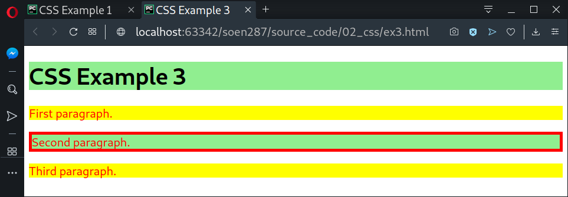

````html
<!DOCTYPE html>
<html lang="en">
<head>
    <meta charset="UTF-8">
    <title>CSS Exemple 3</title>
    <style>
        p {
            color: red;
            background-color: yellow;
        }

        .important {
            background-color: lightgreen;
        }

        p.important {
            border-width: 5px;
            border-style: solid;
        }
    </style>
</head>
<body>
<h1 class="important">CSS Exemple 3</h1>
<p>First paragraph.</p>
<p class="important">Second paragraph.</p>
<p>Third paragraph.</p>
</body>
</html>
````

- `p` correspond à tous les paragraphes
- `.important` correspond à toutes les balises avec `class="important"`
    - dans ce cas-ci, le `<h1>` et le deuxième `<p>`
- `p.important` correspond à tous les paragraphes avec `class="important"`
    - dans ce cas-ci, seulement le deuxième `<p>`

- ***Sélecteur de groupe***: pour sélectionner plusieurs balises différentes,
  séparez les différentes balises avec des virgules
    - par exemple, pour sélectionner plusieurs niveaux de titres, tels que `h1`,
      `h2` et `h3`, utilisez le sélecteur `h1, h2, h3`
    - ceci peut aider à éviter de répéter les mêmes déclarations pour plusieurs
      balises différentes

#### Exemple 4: `ex4.html`

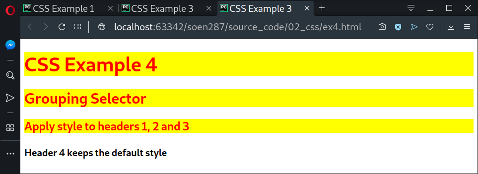

### Feuilles de style externes

- Dans les projets plus grands, quand on doit appliquer la même feuille de style
  sur plusieurs documents HTML, ou quand la feuille de style devient trop
  grande, il est préférable de placer la feuille de style dans un
  _fichier externe_
- À la place d'utiliser la balise `<style>` dans le `<head>`, on doit utiliser
  la balise `<link>`

  `<link rel="stylesheet" type="text/css" href="ex5.css">`

- The contents of the external stylesheet, in this case `ex5.css`, is identical
  to the content of the `<style>` element when using the internal stylesheet

#### Exemple 5: `ex5.html`

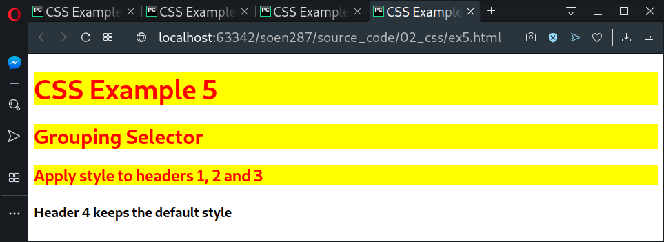

````html
<!DOCTYPE html>
<html lang="en">
<head>
    <meta charset="UTF-8">
    <title>CSS Exemple 5</title>
    <link rel="stylesheet" type="text/css" href="ex5.css">
</head>
<body>
<h1>CSS Exemple 5</h1>
<h2>Grouping Selector</h2>
<h3>Apply style to headers 1, 2 and 3</h3>
<h4>Header 4 keeps the default style</h4>
</body>
</html>
````

#### Fichier : `ex5.css`

````css
h1, h2, h3 {
    color: red;
    background-color: yellow;
}
````

### Le modèle de boîtes du CSS

- Toutes les balises HTML peuvent être considérées comme des boîtes. Dans le
  CSS, l'expression _"modèle de boîtes"_ (_"box model"_ en anglais) est utilisée
  en parlant de design et d'agencement
- Le modèle de boîtes du CSS est essentiellement une boîte qui entoure chaque
  balise HTML

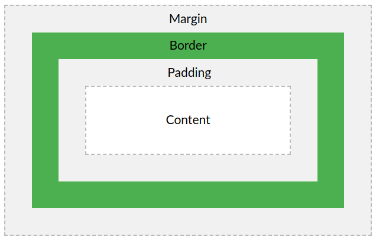

- **Content** (Contenu) : le contenu de la boîte, dans laquelle le texte et les
  images apparaissent
- **Padding** (Rembourrage) : espace transparent autour du contenu
- **Border** (Bordure) : une bordure qui entoure le contenu et le rembourrage
- **Margin** (Marge) : espace transparent qui entoure la bordure

#### Exemple 6: `ex6.html`

- La classe `hidden` peut être utilisée pour cacher certaines balises
    - elle va être expliquée plus en détails un peu plus loin


````html
<!DOCTYPE html>
<html lang="en">
<head>
    <meta charset="UTF-8">
    <title>CSS Exemple 6</title>
    <link rel="stylesheet" type="text/css" href="ex6.css">
</head>
<body>
<h1>CSS Exemple 6</h1>
<dl class="special_box">
    <dt>Content</dt>
    <dd>The content of the box, where text and images appear</dd>
    <dt>Padding</dt>
    <dd>Clears an area around the content. The padding is transparent</dd>
    <dt class="hidden">Border</dt>
    <dd class="hidden">A border that goes around the padding and content</dd>
    <dt>Margin</dt>
    <dd>Clears an area outside the border. The margin is transparent</dd>
</dl>
</body>
</html>
````

#### Fichier `ex6.css`

````css
 .special_box {
    background-color: lightgoldenrodyellow;
    padding: 25px;
    border: 5px solid red;
    margin: 100px;
}

dt {
    font-weight: bolder;
}

/* uncomment either the display or visibility declaration to enable the hidden class */
.hidden {
    /*display: none;*/
    /*visibility: hidden;*/
}
````

### La propriété `display`

- La propriété `display` spécifie si, ou comment, la balise est affichée
- Chaque balise HTML a une valeur de `display` par défaut selon son type de
  balise
- La valeur par défaut de la plupart des balises sont soit `block`, soit `inline`

### Balises de bloc (`block`)

- Une balise de bloc est une balise qui commence toujours sur une nouvelle ligne
  et qui utilise toute la largeur disponible
- Exemples de balise de bloc :

    - `<div>`
    - `<h1>` à `<h6>`
    - `<p>`
    - `<form>`

### Balises en-ligne (`inline`)

- Une balise en-ligne ne commence pas toujours sur une nouvelle ligne et 
  utilise seulement la largeur nécessaire
- Exemples de balise en-ligne :

    - `<span>`
    - `<a>`
    - ``

### Cacher une balise

#### `display: none` ou `visibility: hidden` ?

- Cacher une balise peut être fait en donnant la valeur `none` à la propriété 
  `display` (_affichage = rien_)
    - La balise va être cachée et la page va être affichée comme si la 
      balise n'existait pas
    - modifiez le fichier `ex6.css` en _décommentant_ 
      `display: none` à l'intérieur de la déclaration de classe `hidden` ; 
      ensuite sauvegardez les changements et rechargez le fichier `ex6.html`
- `visibility: hidden` cache aussi une balise
    - Cependant, la balise va utiliser le même espace qu'avant
    - la balise sera cachée, mais va continuer d'affecter l'agencement et 
      l'affichage de la page
    - modifiez le fichier `ex6.css` en commentant `display: none` et en 
      décommentant `visibility: hidden` à l'intérieur de la déclaration de classe `hidden` ;
      ensuite sauvegardez les changements et rechargez le fichier `ex6.html`
    - quoi a changé ?

#### `display: none`

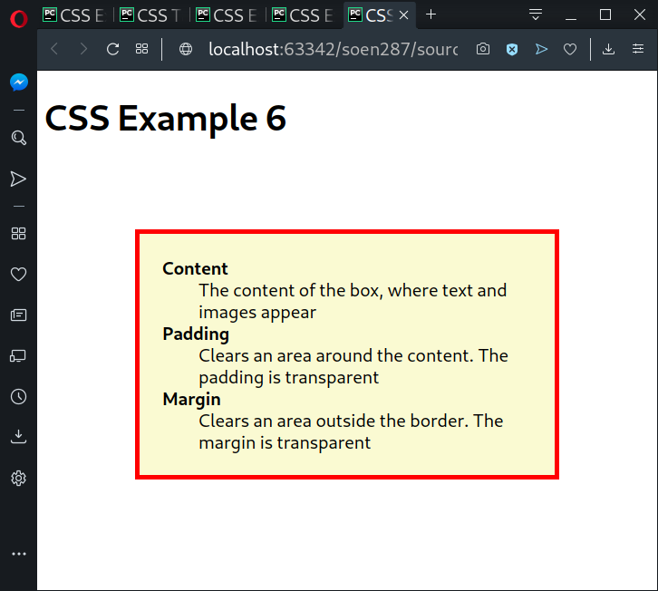

#### `visibility: hidden`

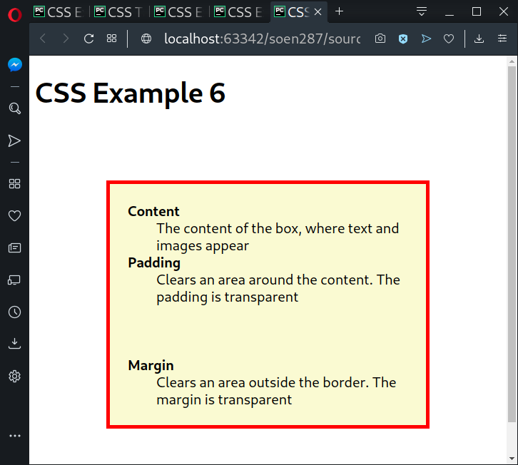

### La propriété `float`

- La propriété `float` est utilisée pour positionner et formater du 
  contenu, par exemple pour placer une image à gauche d'un texte 
  placé dans un conteneur

- La propriété `float` peut avoir les valeurs suivantes :
    - `left`: la balise flotte à gauche de son conteneur
    - `right`: la balise flotte à droite de son conteneur
    - `none`: valeur par défaut ; la balise ne flotte pas, elle est placée 
      où elle apparaît dans le code HTML
    - `inherit`: la balise hérite de la valeur de `float` de sa balise 
      parente

#### Exemple: `css_float.html`

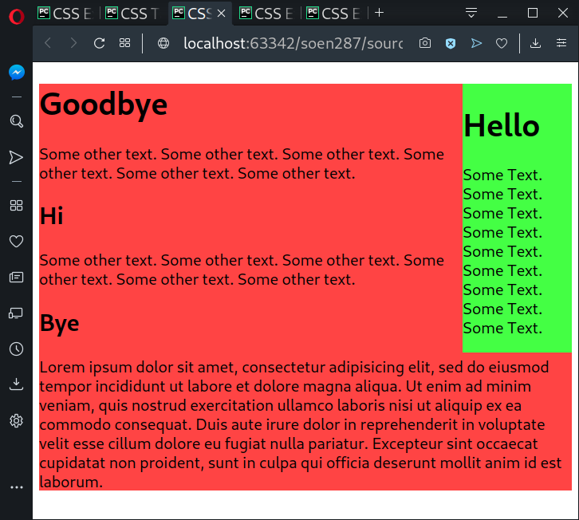

````html
<!DOCTYPE html>
<html lang="en">
<head>
    <title>CSS Exemple 1</title>
    <link rel="stylesheet" type="text/css" href="css_float.css">
</head>
<body>
<div id="floating-div">
    <h1>Hello</h1>
    <p>Some Text. Some Text. Some Text. Some Text. Some Text. Some Text. Some
        Text.
        Some Text. Some Text. </p>
</div>
<div>
    <h1>Goodbye</h1>
    <p>Some other text. Some other text. Some other text. Some other text. Some
        other text. Some other text. </p>
    <h2>Hi</h2>
    <p>Some other text. Some other text. Some other text. Some other text. Some
        other text. Some other text. </p>
    <h2>Bye</h2>
    <p>Lorem ipsum dolor sit amet, consectetur adipisicing elit, sed do eiusmod
        tempor incididunt ut labore et dolore magna aliqua. Ut enim ad minim
        veniam,
        quis nostrud exercitation ullamco laboris nisi ut aliquip ex ea commodo
        consequat. Duis aute irure dolor in reprehenderit in voluptate velit
        esse cillum
        dolore eu fugiat nulla pariatur. Excepteur sint occaecat cupidatat non
        proident,
        sunt in culpa qui officia deserunt mollit anim id est laborum.</p>
</div>
</body>
</html>
````

#### Fichier : `css_float.css`

````css
#floating-div {
    background-color: #44ff44;
    float: right;
    width: 20vw;
    min-width: 100px;
}

div {
    background-color: #ff4444;
}
````

### Tableaux CSS

#### Exemple: `css_table.html`

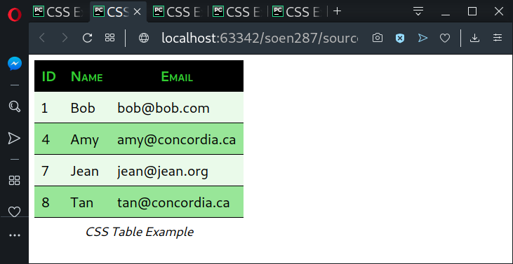

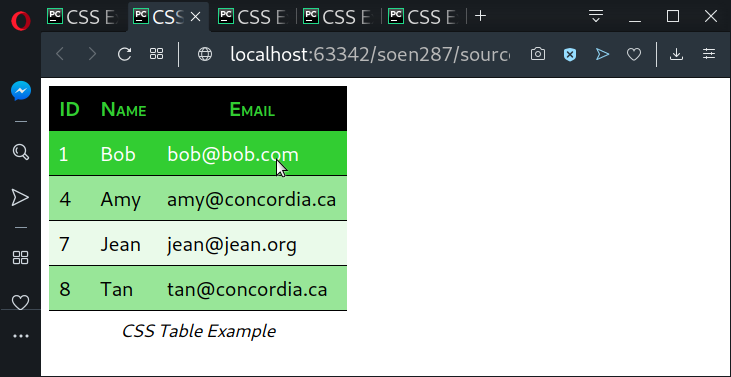

````html
<!DOCTYPE html>
<html lang="en">
<head>
    <title>CSS Table Exemple</title>
    <link rel="stylesheet" type="text/css" href="css_table.css">
</head>
<body>
<table>
    <caption>CSS Table Exemple</caption>
    <tr>
        <th>ID</th>
        <th>Name</th>
        <th>Email</th>
    </tr>
    <tr>
        <td>1</td>
        <td>Bob</td>
        <td>bob@bob.com</td>
    </tr>
    <tr>
        <td>4</td>
        <td>Amy</td>
        <td>amy@concordia.ca</td>
    </tr>
    <tr>
        <td>7</td>
        <td>Jean</td>
        <td>jean@jean.org</td>
    </tr>
    <tr>
        <td>8</td>
        <td>Tan</td>
        <td>tan@concordia.ca</td>
    </tr>
</table>
</body>
</html>
````

#### Fichier `css_table.css`

````css
table {
    border-collapse: collapse;
    color: black;
}

th, td {
    padding: 10px;
    border-bottom: 1px solid black;
}

th {
    font-variant: small-caps;
    text-align: center;
    background-color: black;
    color: limegreen;
}

caption {
    caption-side: bottom;
    font-style: oblique;
    font-size: 75%;
    margin-top: 5px;
}

tr:nth-child(even) {
    background-color: #eafaea;
}

tr:nth-child(odd) {
    background-color: #98e698;
}

tr:hover {
    background-color: limegreen;
    color: white;
}
````

- La propriété `border-collapse` détermine si les bordures devraient 
  s'affaisser dans une seule bordure ou non
    - lui donner la valeur `collapse` va éviter de laisser une espace entre 
      les bordures de cellules et de la table
- Des styles différents sont appliqués à l'entête de table `th`, aux données 
  de la table `td` et à la légende `caption`
- Pour faciliter la lecture des lignes du tableau, les 
  sélecteurs de *pseudo-classes* peuvent être utilisés pour appliquer des styles
  différents, dans cet exemple, aux lignes paires et impaires et aux lignes 
  qui se retrouvent en dessous du curseur de la souris
    - `tr:nth-child(even)` sélectionne seulement les lignes paires du tableau
    - `tr:nth-child(odd)` sélectionne seulement les lignes impaires du tableau
    - `tr:hover` sélectionne seulement les lignes sous le curseur de la souris
    - dans chaque cas, une couleur de fond différente est appliquée, en plus 
      d'une couleur de texte différente pour `:hover`
  
### Barre de navigation

#### Exemple: `css_nav.html`

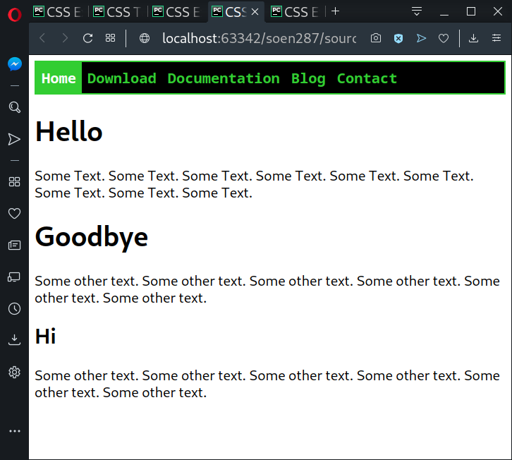

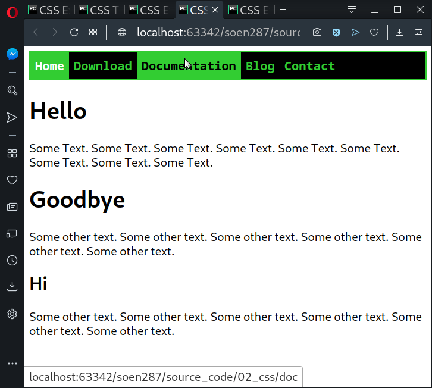

### Barre de navigation = list de liens

- Une barre de navigation est d'abord définie dans le document HTML
- Dans nos exemples, la barre de navigation est construite à partir d'une 
  liste HTML standard
- Une barre de navigation est essentiellement une liste de liens, donc on 
  utilise les balises `<ul>` et `<li>` :
    - le `ul` a la classe `menulist`
    - le `ul` est à l'intérieur d'une `div` avec comme ID `menubar`
      - on pourrait aussi remplacer la `div` par `navbar` si c'est la barre 
        de navigation principale du site
    - chaque `li` a la class `menuitem`, et contient un lien (une balise `<a>`)

- À part cette liste, le document HTML ne contient rien de spécial
    - la *magie* s'opère dans le fichier CSS

````html
<!DOCTYPE html>
<html lang="en">
<head>
    <title>CSS Exemple 2</title>
    <link rel="stylesheet" type="text/css" href="css_nav.css">
</head>
<body>
<div id="menubar">
    <ul class="menulist">
        <li class="menuitem">
            <a class="active" href="">Home</a>
        </li>
        <li class="menuitem">
            <a href="download">Download</a>
        </li>
        <li class="menuitem">
            <a href="doc">Documentation</a>
        </li>
        <li class="menuitem">
            <a href="blog">Blog</a>
        </li>
        <li class="menuitem">
            <a href="contact">Contact</a>
        </li>
    </ul>
</div>

<div id="topheader">
    <h1>Hello</h1>
    <p>Some Text. Some Text. Some Text. Some Text. Some Text. Some Text. Some
        Text. Some Text. Some Text. </p>
</div>
<div>
    <h1>Goodbye</h1>
    <p>Some other text. Some other text. Some other text. Some other text. Some
        other text. Some other text. </p>
    <h2>Hi</h2>
    <p>Some other text. Some other text. Some other text. Some other text. Some
        other text. Some other text. </p>
</div>
</body>
</html>
````

#### Fichier `css_nav.css`

````css
#menubar {
    /* text-align: center;*/ /* for centering menu */
    /* float: right;*/ /* uncomment for vertical menu floating on the right */
    display: block /* block will use full width, flex will not use full width */
    /* make it sticky */
    /*position: -webkit-sticky; /* Safari */
    /*position: sticky; top: 0;*/
}

ul.menulist {
    position: relative;
    overflow: auto;
    list-style-type: none;
    margin: 0;
    padding: 0;
    background-color: black;
    border: 2px solid limegreen;
    font-family: monospace;
    font-size: 1.2em;
    /*width: auto;*/ /* for centering menu */
    /*display: inline-block;*/ /* for centering menu */
}

li.menuitem {
    text-align: center;
    float: left; /* comment out to make a vertical menu */
}

li.menuitem a {
    display: block;
    color: limegreen;
    font-weight: bolder;
    padding: 8px 8px;
    text-decoration: none;
}

li.menuitem a.active {
    background-color: limegreen;
    color: white;
}

li.menuitem a:hover:not(.active) {
    background-color: limegreen;
    color: black;
}
````

### Référence

- W3Schools CSS Tutorial:
  [https://www.w3schools.com/css/css_navbar.asp](https://www.w3schools.com/css/css_navbar.asp)

